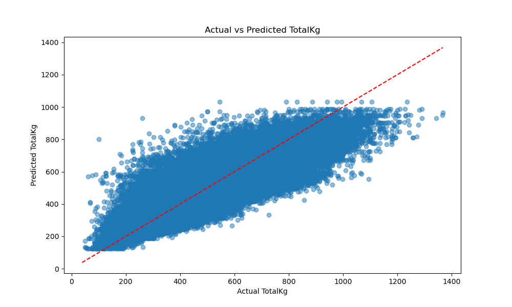

# Powerlifting Data Analysis – Week 1 Project


## Overview
This assignment explores the [OpenPowerlifting dataset](https://www.kaggle.com/datasets/open-powerlifting/powerlifting-database) as part of the two-week data analysis assignment. The goals for this first week are to:
- Import and inspect the dataset.
- Perform basic filtering and grouping.
- Explore a machine learning algorithm including hyperparameters.
- Create one visualization.
- Document findings

---

## Automated Testing

The repository includes a script, `test_powerlifting.py`, which provides automated unit tests for the core data analysis and machine learning workflow. This script uses Python's `unittest` framework and covers:

- **Basic Functionality:**
  - Data loading with both Pandas and Polars
  - Filtering for SBD events
  - Running the machine learning pipeline (LightGBM regression) on a sample

- **Edge Cases:**
  - Handling empty dataframes
  - Missing required columns
  - Features with all missing values
  - No SBD events present
  - Invalid values (e.g., negative weights)

These tests help ensure the robustness of the analysis code, catching common data issues and verifying that the pipeline either handles or fails gracefully in problematic scenarios. To run the tests, execute:

```bash
python test_powerlifting.py
```

All tests should pass if the environment and data are set up correctly.

## Dataset
The dataset comes from **Kaggle**, where it was compiled from publicly available powerlifting competition results.

---

## Large dataset (Git LFS) and local development

The full `openpowerlifting.csv` is tracked with Git LFS in this repository. To work with the real dataset locally or in CI, follow these steps:

- Install Git LFS and enable it for your machine:

```bash
git lfs install
```

- If you clone the repo, fetch LFS files with:

```bash
git lfs pull
```

- CI is configured to download LFS files automatically (the GitHub Actions checkout step uses `lfs: true`).

- For quick local development and to avoid storing huge files in the repo, a small sample `openpowerlifting_sample.csv` is included. The test suite will automatically fall back to this sample if the real CSV is missing or only the LFS pointer is present.

You can also run the helper script to fetch LFS files if available on your machine:

```bash
./scripts/fetch_lfs.sh
```


## Steps Completed

### 1. Importing the Dataset
- Loaded the dataset with **Pandas** using `pd.read_csv()`.
- Loaded the dataset with **Polars** using `pl.read_csv()`.  

### 2. Inspecting the Data
- Inspected with `.head()`, `.info()`, `.describe()`, `.shape` and checks for missing values.
- Also inspected using the **Polars** equivalents

### 3. Basic Filtering and Grouping
- Filter down to only rows for SBD competitions so there are attempts for all lifts
- Filter out people who failed to record a 3-lift total  
- Computed summary statistics such as mean **TotalKg** grouped by sex and equipment type.

### 4. Machine Learning Exploration
- Defined features: `Sex`, `Equipment`, `BodyweightKg`, `AgeClass`.  
- Target variable: `TotalKg`.
- **Polars** and **Pandas** workflows are merged as the data all goes to **Pandas** for **Sklearn** compatibility. 
- Preprocessing:
  - One-hot encoded categorical variables.
  - Imputed missing numeric values with the median.  
- Model:
  - Built a pipeline with **LightGBM Regressor** (`LGBMRegressor`).  
  - Split data into train/test sets.  
  - Performed **RandomizedSearchCV** for hyperparameter tuning.  
- Evaluation:
  - Reported best parameters.
  - Evaluated performance with Mean Squared Error (MSE).

### 5. Visualization
- Created a scatter plot of **Actual vs Predicted TotalKg** with a reference diagonal.  
- This highlights how closely the model’s predictions align with true outcomes.
 

---

## Findings
- The dataset is large, varied, and requires handling categorical and missing values.  
- The model predicts `TotalKg` when accounting for `Sex`, `Equipment`, `BodyweightKg`, `AgeClass`.  
- LightGBM provides a fast algorithm which is useful for training and exploring the numerical target
- LightGBM regression provides a flexible baseline model, with hyperparameter tuning improving results.  
- Visualization shows prediction accuracy is reasonable but with room for refinement.

---
